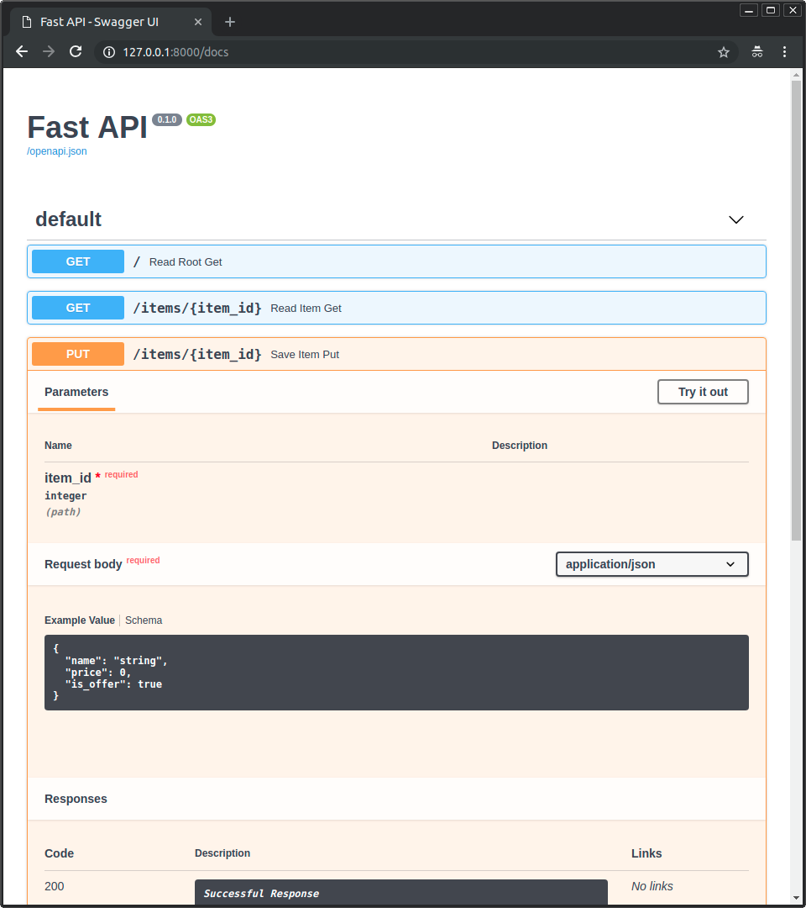
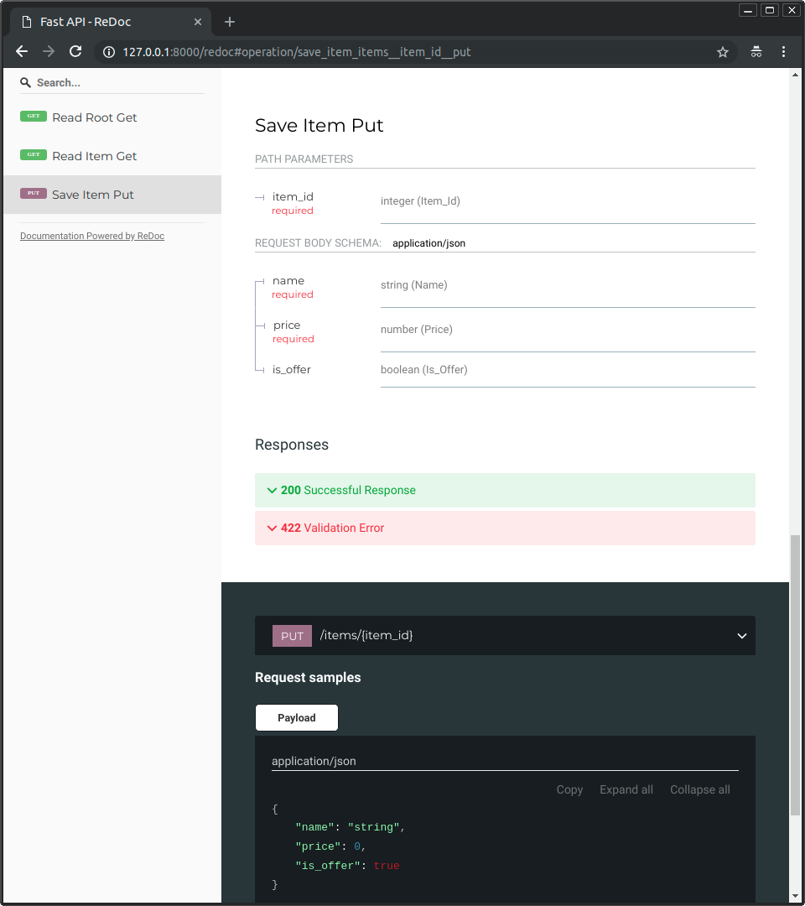

# FastAPI 學習導覽 (FastAPI Learning Guide)

本專案旨在提供 FastAPI 的基礎學習教程與範例實作，幫助開發者快速上手並建立符合 OpenAPI 規格的高效能 Web API。

## 🚀 FastAPI 核心特點

- **快速建立 Web API**：自動符合 OpenAPI 規範，並提供即時互動式 API 文件。
- **卓越效能**：基於 Starlette (ASGI Framework) 與 Pydantic，效能極高，媲美 NodeJS 和 Go。
- **強大支援**：支援 Python 3.7+ (強烈建議使用 Python 3.10+)。

## 🛠️ 開發前準備與建議

1. **基礎知識**：建議先了解 Python Type Hints（型別提示）與 Pydantic。
2. **Web 伺服器**：使用 Uvicorn 作為 Python 的 ASGI Web 伺服器實作。
3. **推薦工具**：建議在 VSCode 中安裝套件 [Thunder Client](https://www.thunderclient.com/) 以利於進行 API 測試。

---

## 🗺️ 學習路線圖 (Roadmap)

請依序閱讀並實作以下章節：

1. 🚀 **[起手式](./01_起手式)** - 環境安裝與第一個 Hello World 測試
2. 🛣️ **[路徑參數 (Path Parameter)](./02_路徑參數_path_parameter)** - 接收並驗證網址路徑中的參數
3. 🔍 **[詢問參數 (Query Parameter)](./03_詢問參數_query_parameter)** - 處理 URL 查詢參數與型別自動轉換
4. 📦 **[Request Body (請求體)](./04_請求體_request_body)** - 利用 Pydantic BaseModel 定義與接收 JSON 資料
5. 💡 **[實際案例 (Real Cases)](./05_實際案例)** - 結合 SQLite 的物聯網 (IoT) 數據上傳與管理專案
6. 🔗 **[依賴注入 (Dependency Injection)](./06_依賴注入_dependency_injection)** - 核心機制，重用邏輯與管理資源生命週期
7. 🛡️ **[跨來源資源共用 (CORS)](./07_跨來源資源共用_cors)** - 解決前後端分離開發時的跨網域請求問題

---

## 📖 自動產生的互動式 API 文件

FastAPI 會根據代碼自動產生以下兩種高品質文件：

### 1. Swagger UI (`/docs`)
提供直覺且可直接在瀏覽器中進行「Try it out」測試的介面：


### 2. ReDoc (`/redoc`)
提供排版優雅、利於閱讀的 API 參考手冊：


---

## 💻 伺服器啟動指令

### 開發本機測試 (預設自動重啟)
```bash
uvicorn main:app --reload
```

### 伺服器部署運行 (指定 Host 與 Port)
```bash
uvicorn index:app --host 0.0.0.0 --port 80
```

> **參數說明**：
> - `main:app` 代表執行 `main.py` 中的 `app` 實體（同理 `index:app` 執行 `index.py` 內的實體）。
> - `--reload` 代表開發模式下自動偵測程式變更並重啟伺服器。

