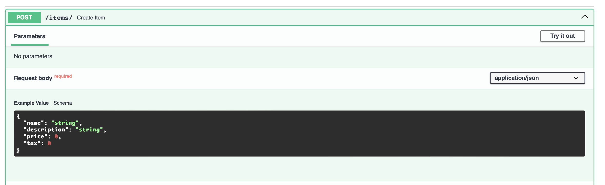
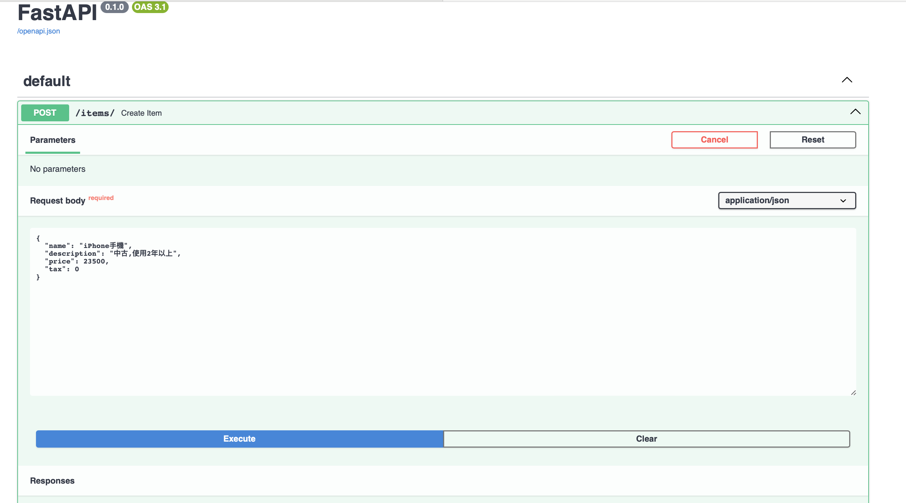
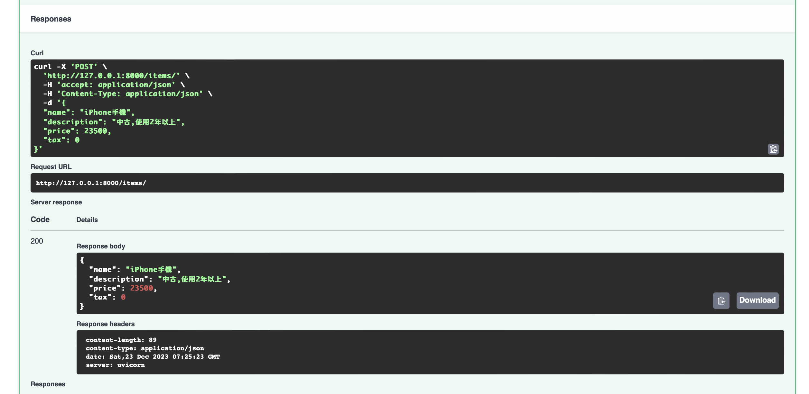
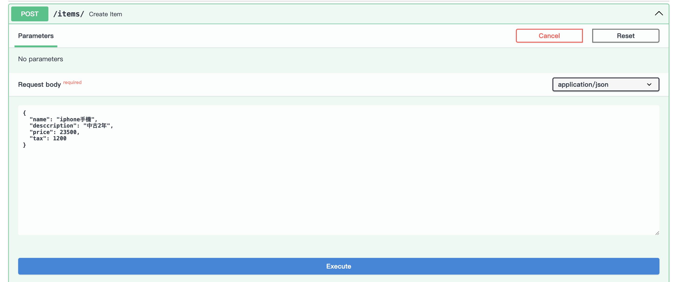
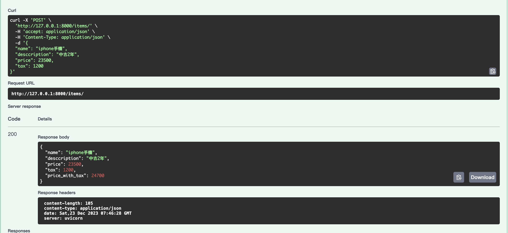

# request的主體(Request Body)

- 當使用者透過browser的表單送出的資料,就是儲存在Request body
- 使用者送給browser送給fastAPI,稱為Request Body
- fastAPI送給client(browser)的程為Response Body
- Response Body一定要有,Request Body不一定要有(如GET)
- POST,PUT,PATCH,DELETE,需要Request Body
- #### 使用fastAPI,定義Request Body最好的是使用 **Pydantic**

## 使用 Pydantic 的 BaseModel

```
from fastapi import FastAPI
from pydantic import BaseModel

class Item(BaseModel):
    name: str
    description: str | None = None
    price:float
    tax:float | None = None

app = FastAPI()

@app.post("/items/")
async def create_item(item: Item):
    return item
```  

### 上面類似定義 JSON(object)或 python dict

```
{
    "name": "Foo",
    "description": "An optional description",
    "price": 45.2,
    "tax": 3.5
}
```

### description和tax是可有可無(Optional)
 
```
{
    "name": "Foo",
    "price": 45.2
}

```

### 參數使用Pydantic BaseMode,FastAPI自動做了下列動作:
#### 1. 讀取Request body當作json
#### 2. 轉換為對應的型別
#### 3. 驗證資料:
- 如果data不是合法的,將優雅失敗,並傳出明確的錯誤(422)
#### 4. 透過參數item,可以接收到資料
#### 5. 自動產生json的schema(架構)
#### 6. json的schema也會自動產生在swagger UI內

### 使用swaggerUI,查詢,測試,驗証

#### 查詢


#### 測試


#### 驗証


### 範例

```
from fastapi import FastAPI
from pydantic import BaseModel

class Item(BaseModel):
    name:str
    desccription: str | None = None
    price:float
    tax:float

app = FastAPI()

@app.post("/items/")
async def create_item(item:Item):
    item_dict = item.model_dump()
    if item.tax:
        price_with_tax = item.price + item.tax
        item_dict.update({'price_with_tax':price_with_tax})
    
    return item_dict
```

#### 測試



#### 驗證




#### 測試

```
curl -X 'POST' \
  'http://127.0.0.1:8000/items/' \
  -H 'accept: application/json' \
  -H 'Content-Type: application/json' \
  -d '{
  "name": "iphone手機",
  "desccription": "中古2年",
  "price": 23500,
  "tax": 1200
}'

#===========結果
{"name":"iphone手機","desccription":"中古2年","price":23500.0,"tax":1200.0,"price_with_tax":24700.0}
```


